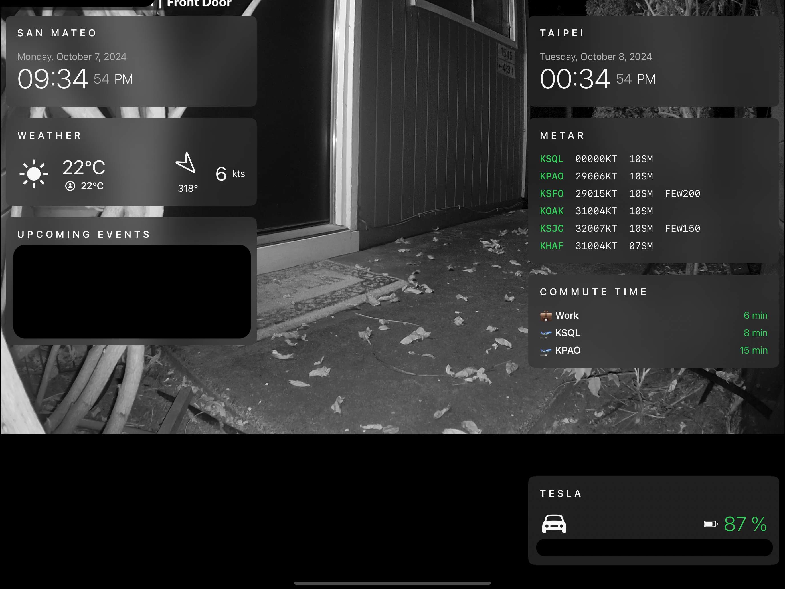

HomePad
=======

My quick and dirty reimplementation of [MagicMirror](https://magicmirror.builders/). This will most likely be a code drop with no updates, but feel free to fork and extend!

## Features

- Modular design
- Inhibits the sleep timer
- Supported Sources:
  - AVWX (for METAR)
  - Tomorrow.io (for Weather)
  - [Calbox](https://github.com/itszero/calbox) (A small calendar server written by me)
  - Google Maps (for commute time)
  - TeslaMate (for battery level, odometer, door unlocked and update available)
  - RTSP for live camera feed (tested with hook up UniFi Protect feed)
